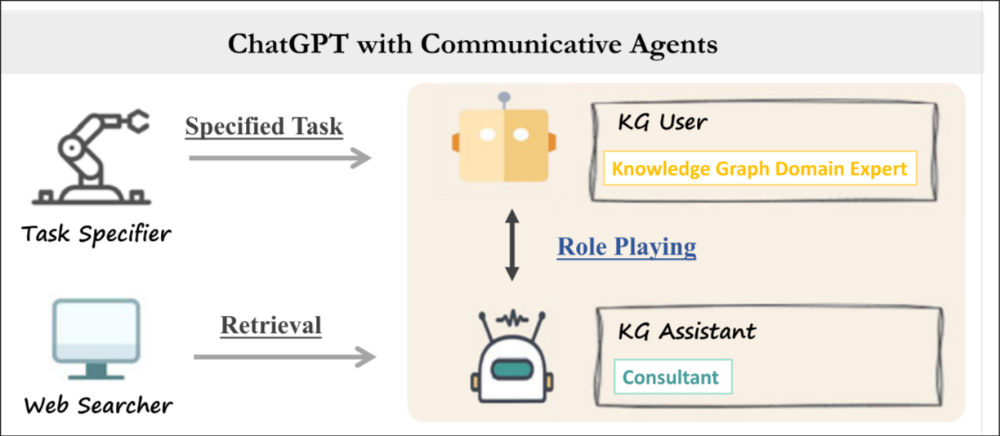

# Overview

With this project, we aim to create a system that produces a knowledge graph of useful information and relations from natural language using recent advancements in LLMs (e.g. LLaMA). This should conform to standard ontologies where applicable with the option of custom ontologies being available should it be necessary. We also aim to allow the merging of multiple knowledge graphs generated from different sources on a subject to unify information.

The semantic web has been largely a failure due to the amount of human labor required to transform natural language into knowledge graphs of standard ontologies. We contend that a semi-automated system utilizing LLMs for the majority of the syntax generation and labor would allow for more sites to be integrated into the Linked Open Data Cloud as well as increasing data uniformity and their ability toe be queried.

We envision our users to be anyone who would like to run structured queries against some text. This includes people who want to explore certain areas of a text without reading the whole project.

In order to accomplish our goals, we intend to use Ollama to run models locally. As well as using an agentic framework such as Autogen to intelligently resolve entities and properties against online sources.

# Background and Related

Some similar techniques already exist for creating knowledge graphs for use alongside LLMs, similar to RAG. They ask the LLM to generate a structured json output of subject, predicate and object. This leads to very flexible graphs, but they don’t allow for the user to perform advanced structured queries easily. [1]

In addition, other architectures have been proposed such as the AutoKG [2], however they’ve not been tested extensively. They propose an Agentic architecture with communication between a knowledge graph user and assistant, both AI models, as seen in figure 1. With the current state of the art, other deep learning techniques currently beat out LLM methods [3], where traditional methods of named entity recognition and relation extraction are utilized, outperforming GPT-4 with basic prompting in their testing.

Figure 1: illustration of proposed AutoKG architecture [2].

# Difficulty

Creating simple knowledge graphs from text using LLMs is trivial [1]. However, producing good knowledge graphs from large text samples proves to be a much more difficult problem, and is still an open problem. Resolving entities to the same objects (such as the Entity alignment problem) is a difficult problem and might increase the difficulty. We are also attempting to use standard ontologies in constructing our knowledge graphs, which increases the difficulty further.

Thus, we rank the difficulty of this project at an 9/10.

# Relevance

Since this topic involves creating knowledge graphs and the Semantic Web in order to better present structured information to users, we believe that this is a very relevant topic for our class, computer support and knowledge management.

# References
[1] “How to construct knowledge graphs.” https://python.langchain.com/docs/how_to/graph_constructing/.

[2] Y. Zhu et al., “LLMS for knowledge graph construction and reasoning: Recent capabilities and future opportunities,” World Wide Web, vol. 27, no. 5, Aug. 2024. doi:10.1007/s11280-024-01297-w

[3] H. Ye, N. Zhang, H. Chen, and H. Chen, “Generative Knowledge Graph Construction: A Review,” Proceedings of the 2022 Conference on Empirical Methods in Natural Language Processing, Dec. 2022. doi:10.18653/v1/2022.emnlp-main.1

[4] L. Ding, S. Zhou, J. Xiao, and J. Han, “Automated construction of theme-specific knowledge graphs,” arXiv.org, https://arxiv.org/abs/2404.19146.

